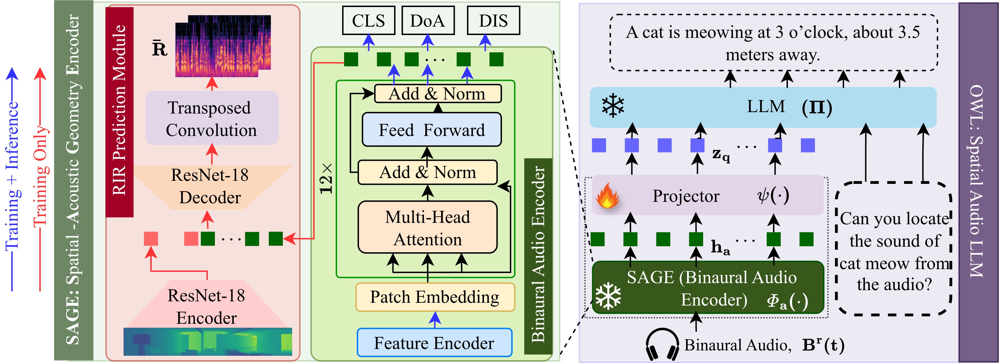
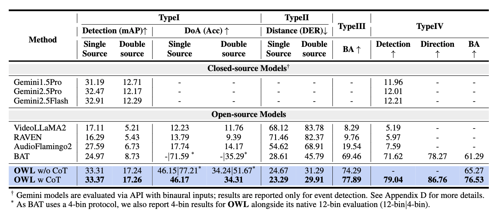
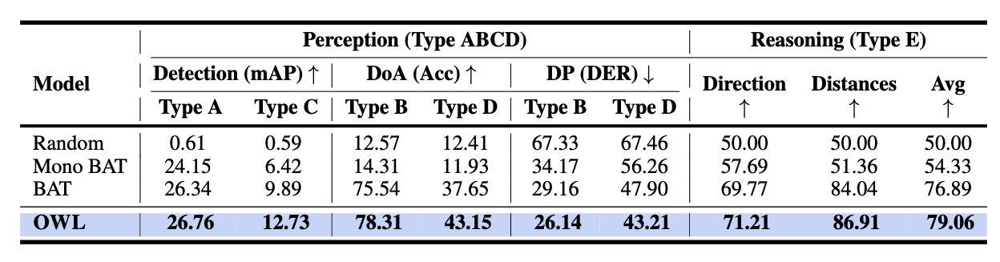

<p align="center">
    
<p>

<h3 align="center">
    <a href="https://arxiv.org/pdf/2505.17114" style="color:#825987">
        OWL: GEOMETRY-AWARE SPATIAL REASONING FOR AUDIO LARGE LANGUAGE MODELS
    </a>
</h3>
<h5 aling="center"> <p align="center" style="color:#FF0000">Accepted at International Conference on Learning Representations (ICLR), 2026 </p></h5>
<h5 align="center">
    Project Page:
    <a href="https://bashlab.github.io/owl_project/" style="color:#825987">
        https://bashlab.github.io/owl_project/
    </a>
</h5>


---

## 🚀 Main Results
##### Comparison of **OWL** with closed- and open-source baselines on BiDepth across four task types: Type I (event detection), Type II (direction estimation), Type III (spatial reasoning), and Type IV (CoT reasoning). **OWL** consistently surpasses prior open-source models, with further gains from CoT supervision. Best results are in **bold**.
<p></p>

##### Zero-shot Performance of **OWL** on the SpatialSoundQA across perception and reasoning tasks. OWL consistently outperforms the baselines, with larger gains in spatial reasoning tasks, demonstrating the benefit of the SAGE and CoT instruction tuning. Best results are denoted in **bold**.
<p></p>


# Installation
```bash
git clone https://github.com/BASHLab/OWL.git
cd OWL

python -m venv venv
source venv/bin/activate

git clone https://github.com/huggingface/transformers.git
cd transformers
git checkout tags/v4.35.2
pip install -e .

cd ..
git clone https://github.com/huggingface/peft.git
cd peft
git checkout tags/v0.6.0
pip install -e .

cd seld_cot/owl
pip install -r requirements.txt
cd ../../

pip install  -e .
```


## 📁 **BiDepth** Dataset

[Coming Soon]()

## 🍀 Model Zoo (coming soon)
| Model Name     | 
|:----------------|
| [SAGE]()| 
| [OWL-LLaMA2-7B]() |
| [OWL-LLaMA3.2-3B]() | 
| [OWL-Qwen2.5-7B-Instruct]() |  
| [OWL-LLaMA2.5-3B]() |  

## 👍 Acknowledgement
The codebase of OWL is adapted from [**SLAM-LLM**](https://github.com/X-LANCE/SLAM-LLM). We are also grateful for their contribution.
